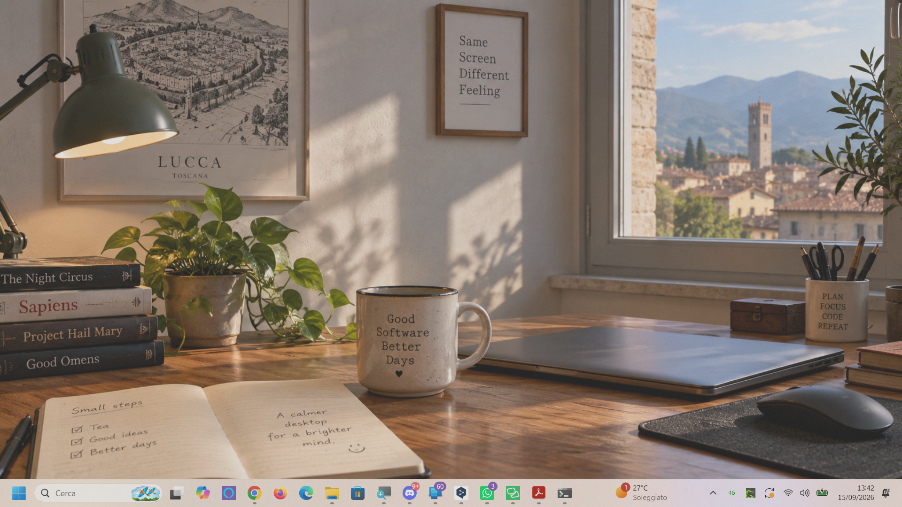
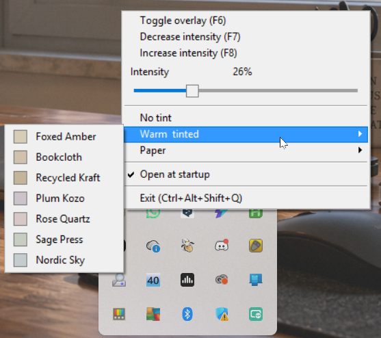

# GrainLayer

[](https://github.com/TagtTheSpellcaster/GrainLayer/releases/latest)
[](https://github.com/TagtTheSpellcaster/GrainLayer/releases)
[](LICENSE)


GrainLayer is a small native Windows utility written in C++/Win32 that places a subtle paper-grain layer over the entire desktop.

It is designed to stay out of the way: the overlay is click-through, while configuration is available from the system tray.

## Features

- Subtle paper-grain overlay across the virtual desktop
- Click-through layered window using per-pixel alpha
- F6: toggle overlay
- F7: decrease intensity
- F8: increase intensity
- Live owner-drawn intensity slider in the tray menu
- Click-to-position and click-and-drag slider interaction
- Warm/tinted and paper presets
- Custom tray/application icon
- Optional Windows startup
- Automatic persistence of overlay state, intensity, and tint
- Exit: Ctrl+Alt+Shift+Q

## Screenshots

GrainLayer is easiest to understand by seeing the same desktop with and without the overlay.

<table>
<tr>
<td><strong>Without GrainLayer</strong></td>
<td><strong>With GrainLayer</strong></td>
</tr>
<tr>
<td></td>
<td></td>
</tr>
</table>

The overlay in the second image is intentionally subtle. The third screenshot shows the tray menu, including the live intensity slider and the available paper and tinted presets.



## Programmer's Manual

A detailed, source-heavy history of the project is available in the **[GrainLayer Programmer's Manual](docs/GrainLayer-Programmers-Manual.md)**, including the evolution from v0.1 (then called Deckle Windows), Win32 architecture, debugging notes, ASCII diagrams, screenshots of the finished application, and complete historical source listings.

A PDF edition is also included: **[GrainLayer Programmer's Manual (PDF)](docs/GrainLayer-Programmers-Manual.pdf)**.

## Building

Requirements:

- Windows
- Visual Studio 2022 with Desktop C++ workload
- Windows SDK
- x64 build tools

Open `GrainLayer.sln` and build the **Release | x64** configuration.

## Inspiration and acknowledgements

GrainLayer belongs to a small lineage of desktop paper-surface projects:

**[Paperman.cc](https://paperman.cc/)** → **[Deckle](https://projects.akshatkatiyar.com/projects/deckle/)** → **GrainLayer**

[Paperman.cc](https://paperman.cc/) is a desktop paper-surface utility for Mac and Windows. **Deckle**, a macOS application created by **Akshat Katiyar**, explicitly cites Paperman as an inspiration. GrainLayer was then developed as an independent Windows project inspired by Deckle.

The relationship is therefore best understood as a chain of inspiration rather than a direct port: Paperman → Deckle → GrainLayer.

GrainLayer is **not affiliated with, endorsed by, or an official Windows port of Deckle or Paperman**.

Special thanks to **Akshat Katiyar** for Deckle and for the inspiration that led to this project, and to the creators of Paperman for the earlier work in this lineage.

## Suggested GitHub topics

```text
ai-assisted-development
c-plus-plus
desktop
deckle
grain
layered-window
overlay
paper-texture
paperman
system-tray
transparency
vibe-coding
win32
windows
```

## About this project

GrainLayer was developed as an experiment in AI-assisted programming using ChatGPT. The project was built incrementally through requirements, testing, debugging, and iterative refinement. The C++ implementation was generated and refined through dialogue with ChatGPT rather than written manually from scratch.

The accompanying guide documents this process as a practical case study of **vibe coding applied to native C++/Win32 development**.

## Project history and guide

The `docs/` directory contains a companion guide following the project from its first working version to v1.4.1, with special attention to the bugs encountered during development and the reasoning behind their fixes.

## Version history

- v0.1 — initial project
- v0.2 — desktop overlay
- v0.3 — per-pixel alpha layered rendering
- v0.6 — tray integration and Win32 shell headers
- v0.8 — feature milestone
- v0.9 — stabilization
- v1.0 — first stable project structure
- v1.1 — intensity control
- v1.2 — owner-drawn slider integrated into the tray menu
- v1.2.4 — fixed menu-item position lookup for slider interaction
- v1.2.5 — live click-and-drag interaction
- v1.2.6 — natural mouse behaviour: hover does not capture or change the slider
- v1.3 — custom application/tray icon
- v1.4 — Windows startup and persistent settings; “Toggle overlay” menu wording
- v1.4.1 — corrected F7/F8 intensity direction; live slider refresh
- v1.4.2 — intensity capped at 75%

## License

MIT. See [LICENSE](LICENSE).
